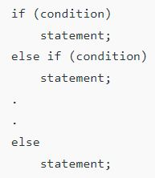
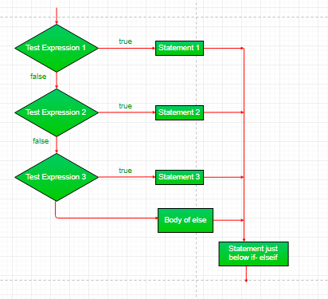
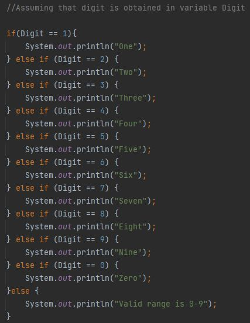

**What is An If-Else-If Ladder?**

It is one of the types of Decision Making Control Structures in Java where the user can decide among multiple options. The expressions are evaluated from the top downward. As soon as an expression evaluates to true, the statement associated with it is executed and the rest of the ladder is bypassed. If none of the expressions are true, the final else gets executed. If the final else is missing, no action takes place if all other conditions are false.

**Syntax of if-else-if ladder:**

**Control Flow of if-else-if ladder:**

**Example of if-else-if ladder:**

