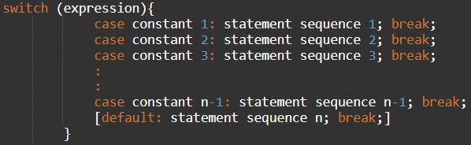
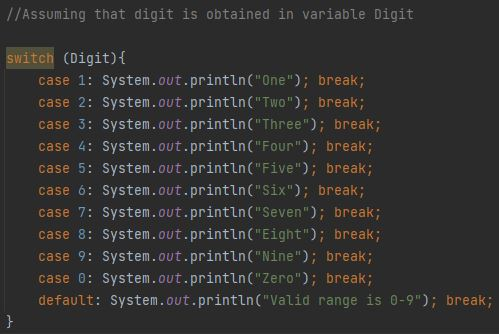

**What is a Switch Statement?** 

Java provides a multiple branch selection statement known as switch. This selection statement successively tests the value of an expression against a list of integer or character constants. When a match is found, the statements associated with that constant are executed.

The expression is evaluated and its values are matched against the values of the constants specified in the case statements. When a match is found, the statement sequence associated with that case is executed until the break statement or the end of switch statement is reached. The default statement gets executed when no match is found. If the control flows to the next case below the matching case, in the absence of break, this is called fall through. The default statement is optional and, if it is missing, no action takes place if all matches fail.

If we do not give break after each case, then Java will start executing the statements from matching case and keep on executing statements for following cases as well until either a break statement is found or switch statement's end is encountered. If the control flows to the next case below the matching case, in the absence of break, this is called fall through.

A case statement cannot exist by itself, outside of a switch. When a break statement is encountered in a switch statement, program execution jumps to the line of code following the switch statement, i.e., outside the body of switch statement.

**Syntax of switch case:**

**Control Flow of switch case:**

**Example of switch case:**

**Some Important Things to know about switch:**
1. A switch statement cannot work for non-equality comparisons.
2. The case labels of switch statements must be literals or constants.
3. No two case labels in the same switch can have identical values. But, in case of nested switch statements the case constants of the inner and outer switch can contain common values. 
4. A switch statement works with data types byte, short, int and char only.