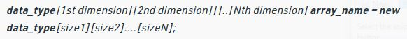
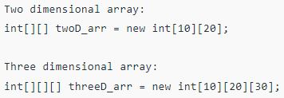
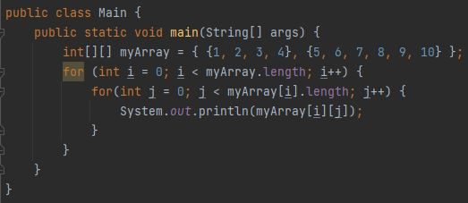
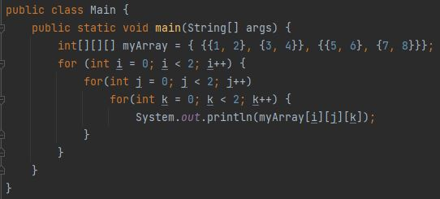

**What is a Multi-Dimensional Array?**

Multi-Dimensional Arrays can be defined in simple words as Array of Arrays. Data in Multi-Dimensional Arrays are stored in tabular form (in row major order).

**Syntax of Multi-Dimensional Array:**

where,

data_type: Type of data to be stored in the array. For example: int, char, etc.

dimension: The dimension of the array created. For example: 1D, 2D, etc.

array_name: Name of the array

size1, size2,..., sizeN: Sizes of the dimensions respectively.

**Examples of Multi-Dimensional Arrays:**

**Size of Multi-Dimensional Array:**

The total number of elements that can be stored in a Multi-Dimensional Array can be calculated by multiplying the size of all the dimensions.

For example,

The array int[][] x = new int[10][20] can store a total of (10*20) = 200 elements.

Similarly, array int[][][] x = new int[5][10][20] can store a total of (5*(10*20)) = 1000 elements.

**Example of 2-D Array:**

**Example of 3-D Array:**

